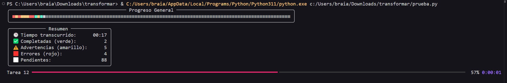

# ffmpeg-auto-optimizer

Herramienta automatizada en Python que convierte videos a una resolución estándar (480p) usando FFmpeg, aplicando optimización inteligente de bitrate para reducir el tamaño de los archivos sin sacrificar calidad innecesariamente.

---

## 🎯 Objetivo

Evitar videos excesivamente pesados o sobrecodificados al:

- Reescalar a 480p con aceleración por GPU (CUDA)
- Reducir FPS si son mayores a 40
- Comprimir audio a 160kbps si es necesario
- Usar `-cq 23` con límites de `-maxrate` y `-bufsize` para balancear calidad y tamaño
- Conservar o reducir el tamaño total sin pérdidas visuales significativas

---

## ⚙️ Requisitos

- Python 3.10+
- [FFmpeg](https://ffmpeg.org/) con soporte `h264_nvenc`
- GPU NVIDIA compatible (opcional pero recomendado)

---

## 🚀 Uso


```bash
python procesar_videos.py
```

## 🛠️ En desarrollo

Actualmente se está trabajando en una pequeña interfaz de consola

